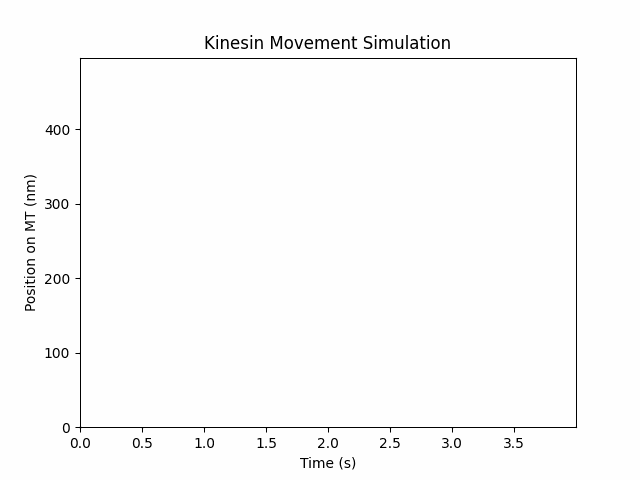

# Monte Carlo modeling of kinesis and dynein with Python

In this project, we will modelise kinesin and dynesin movements on a microtubule using the Monte Carlo algorithm. The algorithm and values used have been taken in the following paper:

> Singh MP, Mallik R, Gross SP, Yu CC. [Monte Carlo modeling of single-molecule cytoplasmic dynein.](https://pubmed.ncbi.nlm.nih.gov/16103365/) Proc Natl Acad Sci U S A. 2005;102(34):12059-12064. doi:10.1073/pnas.0501570102

<br>

# Kinesin 



```python
import numpy as np
from random import uniform

# Creation of the matrices

Nt = 100000*5 # Number of timepoints
x = np.zeros(Nt) # Matrix with positions of the motor on the MT 
t = np.zeros(Nt) # Matrix with timepoints
s = np.zeros(Nt) # Matrix with kinesin head description (1: kinesin binding an ATP molecule
                                                    #    0: kinesin without ATP bound)

# Variables 

delta_t = 1e-5 # length of a time step
step = 8e-9 # taking 8-nm steps
Ktrap = 7e-6 # optical trap stiffness
F0 = 0.7e-11 # stalling force
Kcat0 = 55 # load-dependent rate constant
kB = 1.38064852e-23 # boltzmann constant
T = 300 # temperature (Kelvin)
alpha = 0.3 
Kon = 2e6 # rate constants for binding
ATP = 5e-3 # ATP concentration
Pon = Kon*ATP*delta_t # probability of binding ATP

# Kinesin movement

for i in range (0, Nt-1):
    F = Ktrap*x[i] # load
    Pcat = (Kcat0*np.exp((-alpha*F*step)/(kB*T))) * delta_t # probability of catalysis of ATP

    t[i+1] = t[i] + delta_t

    # Binding/Unbinding ATP 
    p = uniform(0, 1)

    if s[i] == 0:
        s[i+1] = 1 if p <= Pon else 0 # Binding ATP with Pon probability
        x[i+1] = x[i] # MT doesn't move
    else:
        if p <= Pcat: # Hydrolisis takes place with probability Pcat
            epsilon = 1-(F/F0)**2
            p = uniform(0, 1)
            x[i+1] = x[i] + step if p <= epsilon else x[i] # Kinesis takes a step on the MT with probability epsilon
            s[i+1] = 0
        else: # Otherwise, stays at the same place
            s[i+1] = s[i]
            x[i+1] = x[i]

```


