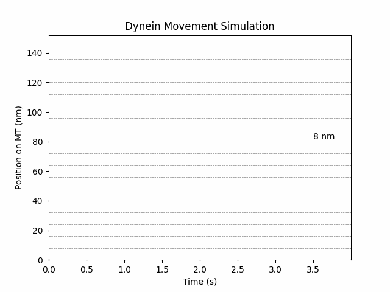

# Monte Carlo modeling of kinesis and dynein with Python

In this project, we will modelise kinesin and dynesin movements on a microtubule using the Monte Carlo algorithm. The algorithm and values used have been taken in the following paper:

> Singh MP, Mallik R, Gross SP, Yu CC. [Monte Carlo modeling of single-molecule cytoplasmic dynein.](https://pubmed.ncbi.nlm.nih.gov/16103365/) Proc Natl Acad Sci U S A. 2005;102(34):12059-12064. doi:10.1073/pnas.0501570102

<br>

# Dynein 




<details>
  <summary>
    Click to see main code.
  </summary>

```python
# bind_unbind(s, ADP_released, F): function returning the new value of s depending if Binding/Unbinding occured. 
# hydrolysis_step(s, x): function returning new values of s, x and if ADP has been released or not, depending on Hydrolysis and if molecular motor took a step or no. 
# Check dev/dynein.py to better understand functions created

for i in range (0, Nt-1):
    ADP_released = False
    F = Ktrap*x[i] # load
    t[i+1] = t[i] + delta_t
    s[i] = bind_unbind(s[i], ADP_released, F)

    if s[i] >= 1:
        s[i+1], x[i+1], ADP_released = hydrolysis_step(s[i], x[i])

    else:
        s[i+1], x[i+1], ADP_released = s[i], x[i], False
```
</details>

 <br /> 

# Kinesin 


<details>
  <summary>
    Click to see main code.
  </summary>

```python
for i in range (0, Nt-1):
    F = Ktrap*x[i] # load
    Pcat = (Kcat0*np.exp((-alpha*F*step)/(kB*T))) * delta_t # probability of catalysis of ATP

    t[i+1] = t[i] + delta_t

    # Binding/Unbinding ATP 
    p = uniform(0, 1)

    if s[i] == 0:
        s[i+1] = 1 if p <= Pon else 0 # Binding ATP with Pon probability
        x[i+1] = x[i] # MT doesn't move
    else:
        if p <= Pcat: # Hydrolisis takes place with probability Pcat
            epsilon = 1-(F/F0)**2
            p = uniform(0, 1)
            x[i+1] = x[i] + step if p <= epsilon else x[i] # Kinesis takes a step on the MT with probability epsilon
            s[i+1] = 0
        else: # Otherwise, stays at the same place
            s[i+1] = s[i]
            x[i+1] = x[i]

```


